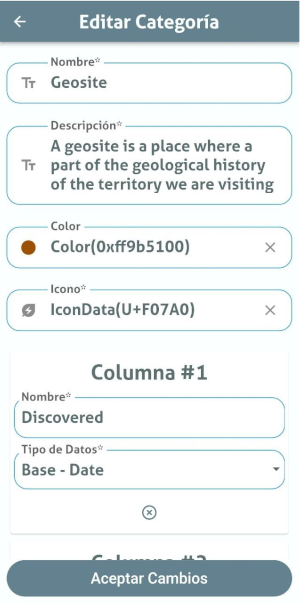
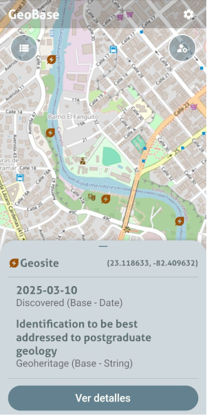

# GeoBase - Flutter Geospatial Management App [](https://creativecommons.org/licenses/by-nc-sa/4.0/)

Welcome to **GeoBase**, a Flutter-based application designed to manage geographical information locally on your device. GeoBase provides a flexible and customizable platform for storing, visualizing, and interacting with geospatial data. Currently focused on Android devices, with future plans to support iOS.

---


## Table of Contents

- [Introduction](#introduction)
- [Features](#features)
- [Getting Started](#getting-started)
  - [Prerequisites](#prerequisites)
  - [Installation](#installation)
- [Usage](#usage)
  - [Adding Geographical Data](#adding-geographical-data)
  - [Customizing the Map](#customizing-the-map)
  - [Managing Data Locally](#managing-data-locally)
- [Future Plans](#future-plans)
- [Contributing](#contributing)
- [Acknowledgments](#acknowledgments)

---

## Introduction

GeoBase is a mobile application built with **Flutter** that allows users to manage geographical information directly on their devices. It provides a customizable map interface and supports local storage of geospatial data, making it ideal for offline use cases such as fieldwork, travel, or personal projects. The app is currently optimized for Android devices, with plans to expand to iOS in the future.

---

## Features

- **Local Data Management**: Store and manage geographical information directly on your device.
- **Customizable Map**: Use flexible and customizable map sources to suit your needs.
- **Offline Support**: Access and interact with your data without an internet connection.
- **Easy Data Import**: Import geospatial data in popular formats like GeoJSON, KML, or CSV.
- **Interactive Visualization**: Visualize geographical data with markers, polygons, and layers.
- **Lightweight and Fast**: Built with Flutter for a smooth and responsive user experience.

---

## Getting Started

### Prerequisites

To run GeoBase, you need the following:

- **Flutter SDK**: Ensure you have Flutter _3.10.3_ installed on your machine. Follow the official [Flutter installation guide](https://flutter.dev/docs/get-started/install) if you haven't already.
- **Android Device or Emulator**: The app is currently optimized for Android. Make sure you have an Android device or emulator set up.
- **Android SDK ^24**: The app is currently running on SDK _24 up to 34_.
- **JDK Version 19**
- **Gradle Version 7.6**

### Installation

1. Clone the Repository:

```bash
git clone https://github.com/lagcleaner/geobase.git
cd geobase
```

2. Install Dependencies:

```bash
Copy
flutter pub get
```

2. Run build_runner:

```bash
Copy
flutter pub run build_runner build
```

3. Run the App:

```bash
Copy
flutter run
```

4. Build the APK (optional):

```bash
Copy
flutter build apk
```

---

## Usage

### Adding Geographical Data

1. Open the app and navigate to the **Data Manager** section.
2. Use the **Import Data** option to add geospatial data in supported formats (e.g., GeoJSON, KML).
3. The imported data will be stored locally and displayed on the map.

### Customizing the Map

1. Go to the **Map Settings** section.
2. Choose from available map sources or add a custom map source (e.g., OpenStreetMap, Google Maps).
3. Adjust map styles, layers, and markers to suit your preferences.

### Managing Data Locally

1. Use the **Data Manager** to view, edit, or delete stored geographical information.
2. Export your data in supported formats for sharing or backup purposes.

---

## Future Plans

- **iOS Support**: Port the app to iOS for broader accessibility.
- **Advanced Analytics**: Add tools for spatial analysis and data processing.
- **Cloud Integration**: Enable synchronization with cloud storage services.
- **Community Plugins**: Support for third-party plugins to extend functionality.

---

## Contributing

We welcome contributions from the community! If you'd like to contribute to GeoBase, please follow these steps:

1. Fork the repository.
2. Create a new branch for your feature or bug fix.
3. Make your changes and commit them with clear, descriptive messages.
4. Push your changes to your fork.
5. Submit a pull request to the main repository.

Please ensure your code follows the project's coding standards and includes appropriate documentation.

---

## Acknowledgments

- **Flutter**: For providing a powerful framework for building cross-platform apps.
- **OpenStreetMap**: For offering free and open map data.
- **GeoJSON Community**: For the widely-used geospatial data format.
- **Contributors**: Thanks to everyone who has contributed to the project!

---

Thank you for using GeoBase! We hope it helps you manage and explore geographical information with ease. If you have any questions, feedback, or feature requests, feel free to open an issue or contact me.

Happy mapping! 🌍
